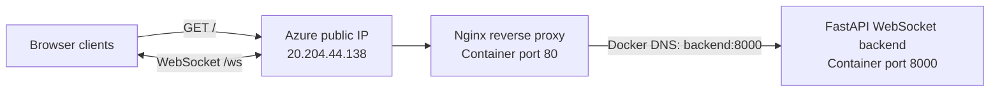
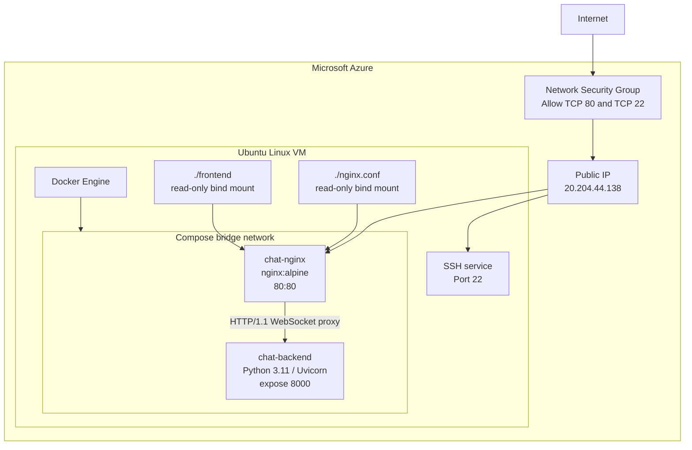
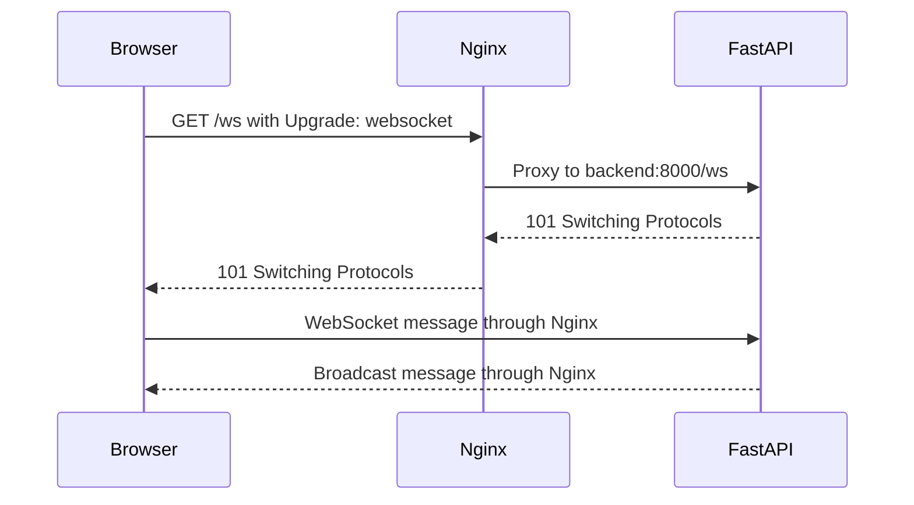
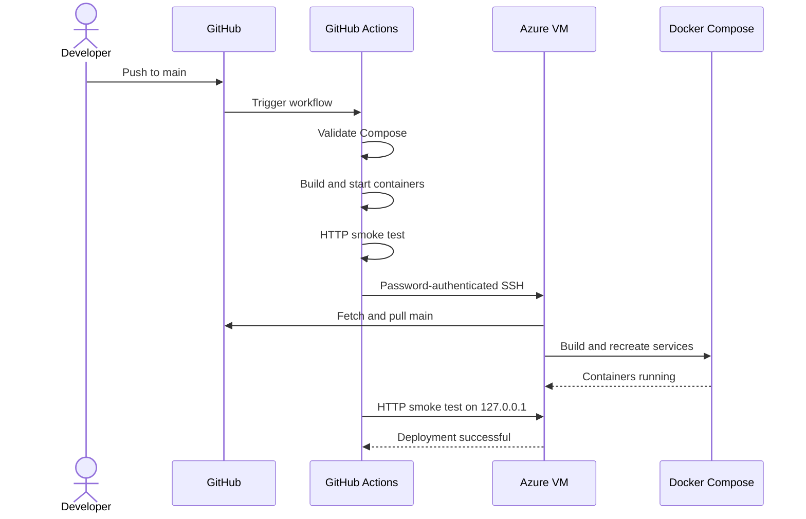

# Architecture — Real-Time WebSocket Chat

## System context

The system exposes one public application endpoint through an Azure Linux VM. Browser
clients use normal HTTP to load the frontend and a persistent WebSocket connection to
exchange chat messages. Nginx is the only publicly exposed application container.



## Deployment architecture



## Component responsibilities

| Component | Responsibility |
|---|---|
| Azure Network Security Group | Permits public HTTP and controlled SSH access |
| Azure Ubuntu VM | Hosts Docker Engine and the checked-out Git repository |
| Docker Compose | Creates services, shared network, mounts, and restart policies |
| Nginx container | Serves the frontend and proxies `/ws` |
| FastAPI container | Accepts WebSockets and broadcasts messages |
| GitHub Actions | Validates, builds, smoke-tests, and deploys each `main` push |

## Network and port model

```text
Browser
   |
   | HTTP :80 and WebSocket :80/ws
   v
Azure NSG and public IP
   |
   v
Nginx container :80
   |
   | Docker Compose bridge network
   | backend:8000
   v
FastAPI container :8000
```

| Source | Destination | Port | Exposure |
|---|---|---:|---|
| Browser | Azure VM/Nginx | `80` | Public |
| GitHub Actions/administrator | Azure SSH service | `22` | Public, authenticated |
| Nginx container | Backend service | `8000` | Internal Compose network only |

The Compose service name `backend` provides stable service discovery. Container IP
addresses can change without requiring an Nginx configuration change.

## HTTP request flow

1. The browser requests `GET /` from the Azure public IP.
2. Azure's Network Security Group permits TCP port `80`.
3. Docker forwards VM port `80` to the Nginx container.
4. Nginx reads `index.html` from its read-only frontend mount.
5. Nginx returns the static frontend to the browser.

## WebSocket connection flow



Nginx uses HTTP/1.1 and forwards both WebSocket upgrade headers:

```nginx
proxy_set_header Upgrade $http_upgrade;
proxy_set_header Connection "upgrade";
```

Long proxy read and send timeouts prevent Nginx from prematurely closing an otherwise
healthy persistent WebSocket connection.

## CI/CD architecture



The deployment job runs only if the CI job succeeds. GitHub Actions secrets provide
the VM hostname, user, password, SSH port, host key, and application directory.
Concurrency permits only one active production deployment.

## Availability and restart behavior

Both containers use `restart: always`. Docker recreates the desired running state
after container crashes and starts the containers again when the VM and Docker daemon
restart.

This deployment uses a single backend instance with in-memory connection state. It is
appropriate for this assignment and a small demonstration. Horizontal scaling would
require shared pub/sub state, such as Redis, plus a load balancer configured for
WebSocket traffic.

## Security boundary

- Only Nginx port `80` is published for application traffic.
- Backend port `8000` remains private to the Compose network.
- Deployment credentials are stored as GitHub Actions secrets.
- SSH host-key verification protects the workflow from connecting to an unexpected VM.
- Frontend and Nginx configuration mounts are read-only.
- HTTPS, `wss://`, and key-based SSH are recommended production improvements.

