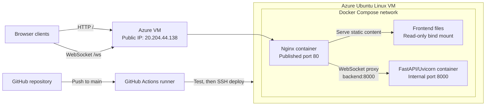

# Real-Time WebSocket Chat — DevOps Deployment

This repository contains a production-style deployment of a real-time FastAPI
WebSocket chat application. The application is containerized with Docker Compose,
served through Nginx, deployed on an Azure Linux virtual machine, and automatically
tested and deployed with GitHub Actions.

The backend application was provided with the assignment. The work in this repository
focuses on debugging and correcting its infrastructure, container networking, reverse
proxy, cloud deployment, and CI/CD automation.

## Live deployment

- Application: [http://20.204.44.138](http://20.204.44.138)
- WebSocket endpoint: `ws://20.204.44.138/ws`
- Source repository: [Sammy6678/Assignment](https://github.com/Sammy6678/Assignment)
- Cloud platform: Microsoft Azure
- Operating system: Ubuntu Linux

> The public IP may change if the VM is deleted or its public IP resource is replaced.

## Architecture



See [ARCHITECTURE.md](ARCHITECTURE.md) for the detailed deployment, traffic, port,
and CI/CD architecture.

## Technology stack

| Layer | Technology | Responsibility |
|---|---|---|
| Frontend | HTML, CSS, JavaScript | Browser chat interface and WebSocket client |
| Backend | Python, FastAPI, Uvicorn | WebSocket connections and message broadcasting |
| Reverse proxy | Nginx Alpine | Static content and WebSocket proxying |
| Containers | Docker and Docker Compose | Build, networking, restart policy, orchestration |
| Cloud | Azure Linux VM | Public deployment host |
| Automation | GitHub Actions | Build, smoke test, and deployment |

## Repository structure

```text
Assignment/
├── .github/
│   └── workflows/
│       └── deploy.yml
├── app/
│   ├── main.py
│   └── requirements.txt
├── frontend/
│   └── index.html
├── ARCHITECTURE.md
├── Dockerfile
├── docker-compose.yml
├── nginx.conf
└── README.md
```

## Container design

### Backend

The `backend` service builds the project Dockerfile using `python:3.11-slim`.
It installs the Python dependencies and starts Uvicorn on port `8000`.

```dockerfile
CMD ["uvicorn", "main:app", "--host", "0.0.0.0", "--port", "8000"]
```

Port `8000` is exposed only to the Compose network; it is not published on the
Azure VM. This prevents clients from bypassing Nginx.

### Nginx

The `nginx` service uses `nginx:alpine`, publishes VM port `80`, and mounts:

- `./frontend` at `/usr/share/nginx/html` as read-only.
- `./nginx.conf` at `/etc/nginx/nginx.conf` as read-only.

Nginx serves the frontend for normal HTTP requests and proxies `/ws` requests to
the backend container.

Both services use `restart: always`, so Docker restarts them following a container
failure or VM restart.

## Docker networking

Docker Compose automatically creates one project-scoped bridge network and attaches
both services to it. Docker's internal DNS resolves the Compose service name
`backend` to the current backend container IP.

Nginx therefore connects to:

```text
backend:8000
```

It must not use `localhost:8000`. Inside the Nginx container, `localhost` refers to
the Nginx container itself, not the FastAPI container.

Only port `80` is published to the VM:

| Port | Scope | Usage |
|---|---|---|
| `80` | Public | Browser HTTP and WebSocket traffic through Nginx |
| `8000` | Compose network only | Nginx-to-FastAPI communication |
| `22` | Azure VM administration | SSH and GitHub Actions deployment |

## Nginx and WebSocket proxying

The browser derives the WebSocket URL from the current page:

```javascript
const protocol = window.location.protocol === 'https:' ? 'wss:' : 'ws:';
const wsUrl = `${protocol}//${window.location.host}/ws`;
```

For a WebSocket request, Nginx:

1. Accepts the browser request on `/ws`.
2. Resolves `backend` using Docker DNS.
3. Proxies it to FastAPI on port `8000`.
4. Uses HTTP/1.1 and forwards the WebSocket upgrade headers.
5. Keeps the long-lived connection open using extended proxy timeouts.

The required configuration is:

```nginx
location /ws {
    proxy_pass http://backend:8000;
    proxy_http_version 1.1;
    proxy_set_header Upgrade $http_upgrade;
    proxy_set_header Connection "upgrade";
}
```

Without the `Upgrade` and `Connection` headers, Nginx treats the request as a normal
HTTP request and the WebSocket handshake fails.

## Deployment issues found and fixed

| File | Original problem | Correction | Result |
|---|---|---|---|
| `Dockerfile` | Uvicorn bound to `127.0.0.1` | Bind to `0.0.0.0` | Backend is reachable from other containers |
| `docker-compose.yml` | Frontend bind mount was disabled | Mount `./frontend` into Nginx | Nginx serves the chat interface |
| `docker-compose.yml` | Obsolete Compose `version` field | Remove the field | Current Compose specification validates cleanly |
| `nginx.conf` | Proxy used `localhost:8000` | Use `backend:8000` | Nginx reaches FastAPI through Docker DNS |
| `nginx.conf` | WebSocket upgrade headers were disabled | Enable `Upgrade` and `Connection` | WebSocket handshake succeeds |

No backend application rewrite was required.

## Run locally

### Prerequisites

- Git
- Docker Desktop or Docker Engine
- Docker Compose v2

Clone and start the project:

```bash
git clone https://github.com/Sammy6678/Assignment.git
cd Assignment
docker compose config
docker compose up -d --build
docker compose ps
```

Open [http://localhost](http://localhost).

Follow logs:

```bash
docker compose logs -f
```

Stop and remove the project containers:

```bash
docker compose down
```

## Local functional test

1. Open `http://localhost` in two browser tabs.
2. Confirm both tabs display `Connected`.
3. Confirm the online user count changes.
4. Send a message from the first tab.
5. Verify the message appears in both tabs.
6. Reply from the second tab and verify both clients receive it.
7. In browser developer tools, confirm `/ws` has a successful WebSocket connection.

## Azure VM deployment

The VM requires:

- Ubuntu Linux.
- A public IP address.
- Azure Network Security Group rules allowing TCP `80` and TCP `22`.
- Git, Docker Engine, the Docker Compose plugin, and curl.
- The deployment user in the `docker` group.

After preparing the VM:

```bash
cd "$HOME"
git clone https://github.com/Sammy6678/Assignment.git
cd Assignment
docker compose up -d --build
docker compose ps
curl --fail http://127.0.0.1/
```

The application is then available at:

```text
http://20.204.44.138
```

The backend port `8000` does not need an Azure inbound security rule.

## CI/CD pipeline

The workflow is defined in `.github/workflows/deploy.yml`.

It runs automatically on every push to `main` and can also be started manually with
`workflow_dispatch`.

### CI stage

1. Checks out the repository.
2. validates `docker compose config`.
3. Builds and starts both containers.
4. Repeatedly requests `http://127.0.0.1/` until the frontend responds.
5. Displays container status.
6. Stops and removes the temporary test containers.

### CD stage

The deployment runs only after CI succeeds:

1. Installs the password-based SSH client on the GitHub runner.
2. Configures SSH host-key verification.
3. Connects to the Azure VM over SSH.
4. Checks Git, Docker, Compose, curl, Docker permissions, and `APP_DIR`.
5. Fetches and fast-forward pulls the latest `main` branch.
6. Runs `docker compose up -d --build --remove-orphans`.
7. Displays container status.
8. Performs a post-deployment HTTP smoke test.

The concurrency setting prevents two production deployments from running at the same
time.

### Required GitHub Actions secrets

Configure these under **Repository Settings → Secrets and variables → Actions**:

| Secret | Purpose | Example |
|---|---|---|
| `SERVER_HOST` | Azure VM public IP | `20.204.44.138` |
| `SERVER_USER` | Linux deployment user | `azureuser` |
| `SERVER_PASSWORD` | Linux user's SSH password | Stored only as a secret |
| `SERVER_PORT` | SSH port | `22` |
| `SERVER_SSH_HOST_KEY` | Trusted SSH host-key record | Output from `ssh-keyscan -H` |
| `APP_DIR` | Repository directory on the VM | `/home/azureuser/Assignment` |

Secrets are injected only into the deployment job and are masked in GitHub Actions
logs. Credentials must never be committed to the repository.

## Deployment verification

After a successful pipeline run:

```bash
cd /home/<user>/Assignment
docker compose ps
docker compose logs
curl --fail http://127.0.0.1/
```

Then test `http://20.204.44.138` in multiple browser tabs.

Expected containers:

```text
chat-backend
chat-nginx
```

## Troubleshooting

### Frontend does not load

```bash
docker compose ps
docker compose logs nginx
```

Confirm Azure permits inbound TCP port `80`.

### WebSocket is disconnected

Confirm that Nginx uses `backend:8000` and forwards the `Upgrade` and `Connection`
headers. Inspect the browser's Network/WebSocket panel and Nginx logs.

### Docker permission denied during deployment

```bash
sudo usermod -aG docker "$USER"
```

Log out and reconnect before running `docker info` again.

### `APP_DIR` does not point to a Git repository

Run this on the VM:

```bash
find "$HOME" -maxdepth 4 -type d -name .git -printf '%h\n'
```

Set `APP_DIR` to the exact returned repository path, excluding `/.git`.

## Security and production considerations

This assignment deployment serves plain HTTP because access through a public IP was
required. A production extension should add a domain and TLS so the browser uses HTTPS
and `wss://`.

SSH password authentication is stored in a protected GitHub secret for this
assignment. A dedicated SSH deployment key is preferable for a production system.
Other useful extensions include monitoring, centralized logs, Redis-backed shared
state, immutable image publishing, and Infrastructure as Code.

### Application hardening

- The WebSocket handshake rejects cross-origin requests, which prevents cross-site
  WebSocket hijacking. Requests without an `Origin` header (non-browser clients) are
  still accepted.
- Chat payloads are length-limited, stripped of control characters, and rate limited
  per connection; the server also caps concurrent connections.
- Interactive API documentation (`/docs`, `/redoc`, `/openapi.json`) is disabled unless
  `ENABLE_DOCS=true`.
- Nginx sends `X-Content-Type-Options`, `X-Frame-Options`, `Referrer-Policy`, and a
  Content Security Policy, and hides its version banner.
- The backend image runs as an unprivileged user and Python dependencies are pinned.

### Backend environment variables

| Variable | Default | Purpose |
|---|---|---|
| `ALLOWED_ORIGINS` | empty (same-origin only) | Comma-separated origin allowlist for the WebSocket |
| `ENABLE_DOCS` | `false` | Expose the FastAPI documentation endpoints |
| `MAX_MESSAGE_LENGTH` | `2000` | Maximum characters per chat message |
| `MAX_CONNECTIONS` | `200` | Maximum concurrent WebSocket connections |
| `RATE_LIMIT_MESSAGES` | `10` | Messages allowed per window, per connection |
| `RATE_LIMIT_WINDOW_SECONDS` | `5` | Length of the rate-limit window |

## Submission

- GitHub repository: [https://github.com/Sammy6678/Assignment](https://github.com/Sammy6678/Assignment)
- Live application: [http://20.204.44.138](http://20.204.44.138)
- Architecture: [ARCHITECTURE.md](ARCHITECTURE.md)
- CI/CD workflow: [deploy.yml](.github/workflows/deploy.yml)
